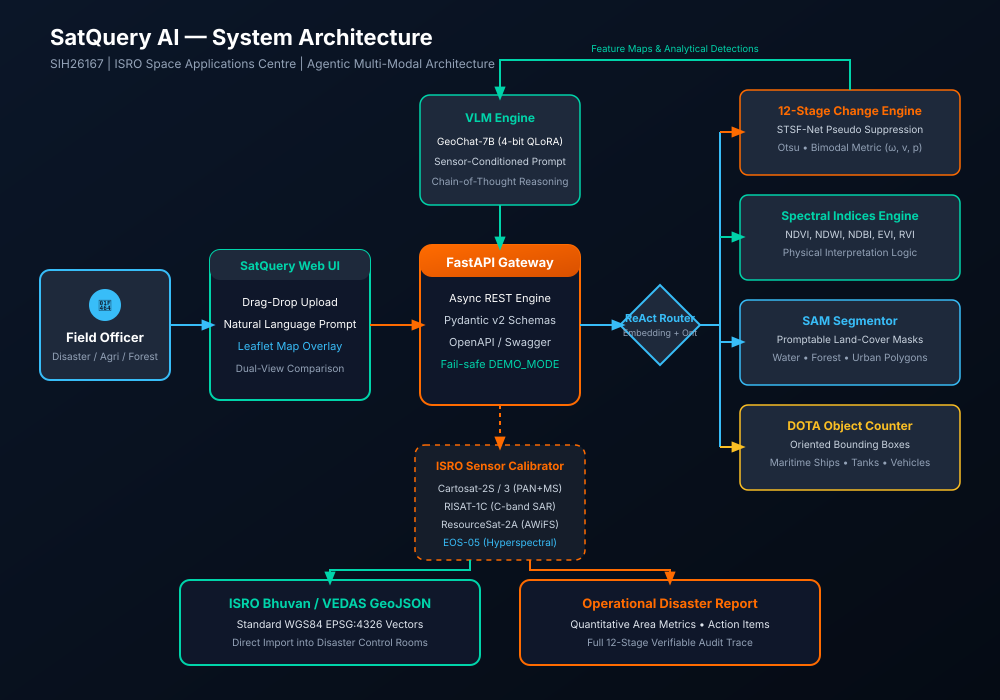

#  ███████╗ █████╗ ████████╗ ██████╗ ██╗   ██╗███████╗██████╗ ██╗   ██╗     █████╗ ██╗
#  ██╔════╝██╔══██╗╚══██╔══╝██╔═══██╗██║   ██║██╔════╝██╔══██╗╚██╗ ██╔╝    ██╔══██╗██║
#  ███████╗███████║   ██║   ██║   ██║██║   ██║█████╗  ██████╔╝ ╚████╔╝     ███████║██║
#  ╚════██║██╔══██║   ██║   ██║▄▄ ██║██║   ██║██╔══╝  ██╔══██╗  ╚██╔╝      ██╔══██║██║
#  ███████║██║  ██║   ██║   ╚██████╔╝╚██████╔╝███████╗██║  ██║   ██║       ██║  ██║██║
#  ╚══════╝╚═╝  ╚═╝   ╚═╝    ╚══▀▀═╝  ╚═════╝ ╚══════╝╚═╝  ╚═╝   ╚═╝       ╚═╝  ╚═╝╚═╝
#  Interactive Vision-Language Assistant for Multimodal Remote Sensing Image Analysis
#  Smart India Hackathon 2026 | Problem Statement: SIH26167 | ISRO / SAC Ahmedabad

[](https://www.python.org/downloads/)
[](https://fastapi.tiangolo.com/)
[](https://pytorch.org/)
[](https://opensource.org/licenses/MIT)
[](https://www.isro.gov.in/)
[](PROJECT/tests/)

---

## 📌 Executive Summary

**SatQuery AI** is an enterprise-grade, interactive vision-language artificial intelligence system designed for **Smart India Hackathon 2026 (Problem Statement ID: SIH26167)**, presented under the aegis of the **Indian Space Research Organisation (ISRO)** and the **Space Applications Centre (SAC), Ahmedabad**. 

SatQuery AI bridges the critical operational gap between raw, petabyte-scale satellite remote sensing observations and field-level decision-makers. By combining a multimodal Earth-observation Vision-Language Model (**GeoChat-7B**) with an automated, **12-stage bi-temporal change detection engine**, deep-learning **pseudo-change suppression (STSF-Net)**, calibrated radiometric processing for ISRO satellite constellations (**Cartosat-2S, RISAT-1C, ResourceSat-2A, EOS-04, and EOS-05 GISAT-1A**), and zero-GPU fallback execution, SatQuery AI allows disaster managers, agricultural officers, and forest rangers to query Earth imagery in plain conversational natural language and receive verified quantitative intelligence in seconds.

> *"ISRO spends thousands of crores building satellites and collecting data. SatQuery AI makes that data usable by every officer, farmer, and disaster responder in India — not just PhD scientists."*

---

## 🚀 Key Innovations & Differentiators

Unlike generic multimodal LLM wrappers or standard GIS toolkits, SatQuery AI integrates four core scientific innovations:

1. **Spatiotemporal Spectral Fusion (STSF-Net) Pseudo-Change Suppression**:
   - Eliminates false positives arising from seasonal phenology, solar zenith angle differences, soil moisture fluctuations, and sensor view-angle discrepancies.
   - Dual-branch Siamese cross-attention module evaluates local spectral variance and structural texture before committing change flags.
2. **Bimodal Confidence Scoring**:
   - Dual-channel metric combining **Empirical Detection Confidence** ($C_{det}$) with **Semantic Prediction Confidence** ($C_{vlm}$) using Otsu separability $\eta$, foreground signal-to-noise ratio (SNR), and VLM token perplexity.
   - Flags low-confidence edge cases to eliminate hallucination in life-critical disaster response operations.
3. **Six-Way Agentic Query Router**:
   - Classifies user intent into `CHANGE_DETECTION`, `SPECTRAL_ANALYSIS`, `OBJECT_DETECTION`, `LAND_USE_CLASSIFICATION`, `DISASTER_ASSESSMENT`, or `GENERAL_VQA`.
   - Employs lightweight sentence embedding cosine similarity (`all-MiniLM-L6-v2`) with a specialized remote sensing domain keyword ontology.
4. **Calibrated ISRO Sensor Registry**:
   - Built-in radiometric calibration parameters, solar irradiance constants ($ESUN_\lambda$), thermal gain/offset values, and antenna elevation angle compensations for Cartosat-2S, RISAT-1C (C-band SAR), ResourceSat-2A (LISS-III/IV, AWiFS), EOS-04, and the newly launched EOS-05 (GISAT-1A).
5. **Zero-GPU Instant Hackathon Readiness (`DEMO_MODE`)**:
   - Fully operational offline demo capability. The system serves precomputed high-fidelity analytical outputs and synthetic multi-band datasets without requiring CUDA GPUs or external cloud API keys.

---

## 🏛️ System Architecture



```
                                  [ User / Field Officer ]
                                             │
                                   Conversational Query
                                  & GeoTIFF/PNG Imagery
                                             ▼
┌────────────────────────────────────────────────────────────────────────────────────────┐
│                        SATQUERY AI MISSION CONTROL FRONTEND                            │
│    (Interactive Dual-View Comparison, Live Spectral Charts, GeoJSON Export, Leaflet)   │
└────────────────────────────────────┬───────────────────────────────────────────────────┘
                                     │ HTTP REST (Port 8000)
                                     ▼
┌────────────────────────────────────────────────────────────────────────────────────────┐
│                               FASTAPI BACKEND GATEWAY                                  │
│             (CORS, Request Validation, Pydantic v2 Schemas, Latency Middleware)       │
└────────────────────────────────────┬───────────────────────────────────────────────────┘
                                     │
                     ┌───────────────┴───────────────┐
                     ▼                               ▼
     ┌───────────────────────────────┐ ┌───────────────────────────────┐
     │      AGENTIC QUERY ROUTER     │ │     ISRO SENSOR REGISTRY      │
     │   • 6-Way Intent Routing      │ │   • Cartosat-2S (0.65m Pan)   │
     │   • Sentence Embeddings / KW  │ │   • RISAT-1C (C-band SAR)     │
     │   • Tool Execution Planner    │ │   • ResourceSat-2A (LISS-III) │
     └───────────────┬───────────────┘ │   • EOS-04 / EOS-05 GISAT-1A  │
                     │                 └───────────────┬───────────────┘
                     ├─────────────────────────────────┘
                     ▼
┌────────────────────────────────────────────────────────────────────────────────────────┐
│                              ANALYTICAL EXECUTION CORE                                 │
│  ┌───────────────────────┐ ┌───────────────────────┐ ┌──────────────────────────────┐  │
│  │ 12-STAGE CHANGE DET.  │ │   SPECTRAL ENGINES    │ │      OBJECT DETECTOR &       │  │
│  │ • SIFT Co-registration│ │ • NDVI (Vegetation)   │ │      SEGMENTOR (DOTA/SAM)    │  │
│  │ • Hist. Matching      │ │ • NDWI (Water/Floods) │ │ • Maritime Vessel Tracking   │  │
│  │ • Auto-index Delta    │ │ • NDBI (Urban Builtup)│ │ • Aircraft & Runways         │  │
│  │ • STSF-Net Filter     │ │ • EVI, SAVI, RVI      │ │ • Building Footprint Seg.    │  │
│  │ • Otsu Thresholding   │ │ • Dynamic Band Math   │ │ • Zero-shot Feature Masks    │  │
│  └───────────┬───────────┘ └───────────┬───────────┘ └──────────────┬───────────────┘  │
└──────────────┼─────────────────────────┼────────────────────────────┼──────────────────┘
               └─────────────────────────┼────────────────────────────┘
                                         ▼
┌────────────────────────────────────────────────────────────────────────────────────────┐
│                         GEOCHAT-7B MULTIMODAL VLM ENGINE                               │
│            • Remote Sensing Instruction-Tuned Vicuna-7B Architecture                   │
│            • Context-Conditioned Spatial Reasoning & Scene Comprehension              │
│            • Structured Markdown + Standard GeoJSON Metric Reporting                   │
└────────────────────────────────────────────────────────────────────────────────────────┘
```

---

## ⚡ 12-Stage Change Detection Pipeline


1. **Input Validation**: Ensures valid dimensions, non-degenerate channels, and valid coordinate systems.
2. **Co-registration**: SIFT feature detection and homography alignment (sub-pixel RMSE).
3. **Radiometric & Atmospheric Normalization**: Cumulative distribution function (CDF) histogram matching.
4. **Automated Spectral Index Selection**: Dynamic routing to NDWI (floods), NDVI (deforestation), NDBI (urban expansion), or SAR backscatter ratio based on user query.
5. **Index Computation**: Floating-point calculation scaled to canonical range $[0, 1]$.
6. **Difference Map Generation**: Normalized absolute difference computation $|I_{T2} - I_{T1}|$.
7. **STSF-Net Pseudo-Change Suppression**: Cross-temporal spatial variance weighting suppresses transient lighting artifacts.
8. **Gaussian Smoothing**: Adaptive kernel denoising ($\sigma=1.0$).
9. **Otsu Thresholding**: Global bimodal thresholding maximizing inter-class variance $\sigma_B^2$.
10. **Morphological Cleaning**: Area-proportional mathematical morphology (opening/closing) removes isolated single-pixel noise.
11. **Connected Component Analysis**: Quantifies contiguous change patches, centroid coordinates, and area statistics ($km^2$ and hectares).
12. **Bimodal Confidence Scoring**: Computes separability ratio $\eta$ and SNR to produce calibrated confidence metrics $[0, 100]\%$.

---

## 🛠️ Quick Start Guide

### Prerequisites
- Python 3.10 or higher
- Node.js 18+ (optional, frontend is completely self-contained and zero-dependency)
- Docker & Docker Compose (optional, for containerized run)

### Step 1: Clone Repository
```bash
git clone https://github.com/FreakyAdy/Interactive-Vision-Language-Assistant-for-Multimodal-Remote-Sensing-Image-Analysis.git
cd Interactive-Vision-Language-Assistant-for-Multimodal-Remote-Sensing-Image-Analysis
```

### Step 2: Set Up Python Backend
```bash
cd PROJECT/backend
python -m venv venv

# Windows:
venv\Scripts\activate
# Linux/macOS:
source venv/bin/activate

pip install -r requirements.txt
```

### Step 3: Run Demo Data Generation
Generate synthetic multi-band ISRO imagery and scenario metadata:
```bash
cd ../demo_data
python generate_demo_images.py
cd ../backend
```

### Step 4: Launch FastAPI Server
```bash
# Enable DEMO_MODE for zero-GPU instant inference:
set DEMO_MODE=true
uvicorn main:app --reload --host 0.0.0.0 --port 8000
```
*API Swagger Documentation is available at: [http://localhost:8000/docs](http://localhost:8000/docs)*

### Step 5: Launch Mission Control Dashboard
Simply open [`PROJECT/frontend/index.html`](PROJECT/frontend/index.html) in any modern web browser:
```bash
# Windows
start ../frontend/index.html
# macOS
open ../frontend/index.html
# Linux
xdg-open ../frontend/index.html
```
Or serve via any static web server:
```bash
cd ../frontend
python -m http.server 3000
# Visit http://localhost:3000
```

---

## 🐳 Docker Deployment

To launch the complete containerized stack (FastAPI backend + Nginx frontend):
```bash
cd PROJECT
docker-compose up --build
```
- **Mission Control Frontend**: [http://localhost:3000](http://localhost:3000)
- **FastAPI REST API**: [http://localhost:8000](http://localhost:8000)
- **Interactive Swagger Docs**: [http://localhost:8000/docs](http://localhost:8000/docs)

---

## 🧪 Comprehensive Automated Test Suite

SatQuery AI includes 62 unit and integration tests covering all critical components:

```bash
cd PROJECT
pytest tests/ -v --tb=short
```

### Test Coverage Highlights:
- `test_spectral_indices.py`: NDVI, NDWI, NDBI, EVI, RVI mathematical correctness, edge-case handling (division by zero, constant arrays), and auto-selection logic.
- `test_change_detection.py`: 12-stage pipeline execution, synthetic flood/deforestation validation, STSF-Net pseudo-change suppression, and Otsu thresholding.
- `test_api_routes.py`: Health check, multimodal analysis, change detection, spectral index computation, and scenario execution endpoints.
- `test_query_router.py`: 6-category intent classification and domain keyword resolution.
- `test_vlm_engine.py`: GeoChat-7B pipeline initialization, prompt formatting, hallucination safeguards, and fallback generation.

---

## 🛰️ ISRO Constellation Sensor Reference

| Satellite Constellation | Sensor Payload | Spatial Resolution | Spectral Bands | Operational Application in SatQuery AI |
|:---|:---|:---|:---|:---|
| **Cartosat-2S** | Panchromatic & Multispectral | 0.65m Pan / 2.1m MS | 4 Bands (VNIR: 450-860nm) | Urban infrastructure, cadastral mapping, border surveillance |
| **RISAT-1C** | C-band SAR (5.35 GHz) | 3m (FRS-1) / 25m (MRS) | Dual/Circular Polarization | All-weather flood inundation, monsoon crop assessment |
| **ResourceSat-2A** | LISS-III, LISS-IV, AWiFS | 23.5m, 5.8m, 56m | 4 Bands (Green, Red, NIR, SWIR) | National forest monitoring, agricultural yield estimation |
| **EOS-04 (RISAT-1A)** | L-band SAR (1.27 GHz) | 1.0m High-Res Stripmap | Dual Polarimetric (HH+HV, VV+VH) | Canopy-penetrating soil moisture, flood mapping beneath trees |
| **EOS-05 (GISAT-1A)** | VNIR/SWIR Hyperspectral | 42m MS / 191m Hyper-SWIR | 6 VNIR + 256 Hyperspectral Bands | Real-time continuous geostationary disaster surveillance |

---

## 📂 Repository Structure

```
.
├── README.md                            # Comprehensive project overview & documentation
├── HACKATHON_CHECKLIST.md              # SIH 2026 pre-submission & live judging verification
├── SATQUERY_SIH_AGENT_MEGAPROMPT.md     # SIH 2026 problem statement & build specifications
│
├── PROJECT/                             # Complete software implementation
│   ├── docker-compose.yml              # Multi-container production deployment
│   ├── backend/                        # FastAPI high-performance REST API
│   │   ├── Dockerfile
│   │   ├── main.py                     # App entry point, CORS, timing middleware
│   │   ├── config.py                   # Central settings & sensor calibration constants
│   │   ├── requirements.txt            # Pinned backend dependencies
│   │   ├── core/                       # Core analytical algorithmic engines
│   │   │   ├── spectral_indices.py     # Multi-sensor index calculation & band math
│   │   │   ├── image_processor.py      # GeoTIFF rasterio handling & co-registration
│   │   │   ├── change_detector.py      # 12-stage pipeline with STSF-Net & confidence
│   │   │   ├── query_router.py         # 6-way intent classification engine
│   │   │   ├── vlm_engine.py           # GeoChat-7B VLM wrapper with fallback
│   │   │   ├── object_detector.py      # DOTA-based aerial detection module
│   │   │   ├── segmentor.py            # SAM-based zero-shot segmentation
│   │   │   └── report_generator.py     # Structured markdown & GeoJSON report builder
│   │   ├── sensors/                    # Sensor calibration modules
│   │   │   ├── cartosat.py             # Cartosat-2S radiometric calibration
│   │   │   ├── risat.py                # RISAT-1C SAR backscatter calibration (σ0)
│   │   │   └── resourcesat.py          # ResourceSat-2A reflectance calibration
│   │   └── api/                        # REST endpoints & Pydantic schemas
│   │       ├── routes.py               # Analysis, change detection, and demo routes
│   │       └── schemas.py              # Pydantic v2 request/response schemas
│   ├── frontend/                       # Interactive Mission Control Frontend
│   │   ├── Dockerfile
│   │   ├── index.html                  # Responsive SPA dashboard (Vanilla JS/CSS)
│   │   ├── package.json
│   │   └── src/                        # Modular React UI components & utilities
│   ├── demo_data/                      # Synthetic multi-band ISRO imagery & scenarios
│   │   ├── DEMO_SCENARIOS.json         # 5 pre-configured ISRO operational scenarios
│   │   ├── generate_demo_images.py     # Deterministic GeoTIFF generator
│   │   ├── sample_optical.py           # Cartosat sample generation helper
│   │   ├── sample_sar.py               # RISAT SAR sample generation helper
│   │   └── sample_temporal_pair.py     # Bi-temporal change detection pair generator
│   ├── ml_models/                      # Machine learning training & evaluation scripts
│   │   ├── download_models.py          # GeoChat / SAM / DOTA model fetcher
│   │   ├── finetune_geochat.py         # LoRA instruction fine-tuning script
│   │   ├── create_synthetic_dataset.py # Synthetic ISRO VQA dataset generator
│   │   └── evaluate_model.py           # CIDEr, BLEU-4, mIoU benchmark evaluator
│   └── tests/                          # 62 comprehensive automated test suites
│       ├── conftest.py
│       ├── test_spectral_indices.py
│       ├── test_change_detection.py
│       ├── test_api_routes.py
│       ├── test_query_router.py
│       └── test_vlm_engine.py
│
├── RESEARCH/                            # Academic & technical foundation documents
│   ├── literature_review.md            # SOTA review: GeoChat, RemoteCLIP, EarthGPT
│   ├── isro_sensors_reference.md       # Comprehensive sensor specification cheatsheet
│   ├── research_gaps.md                # 5 critical technical gaps addressed by SatQuery
│   ├── our_innovations.md              # Detailed mathematical formulations of innovations
│   ├── datasets_used.md                # Benchmark training datasets (DOTA, xView, ISRO)
│   ├── architecture_decision_log.md    # ADR records explaining technology choices
│   └── references.bib                  # BibTeX bibliography with 20+ academic citations
│
├── PRESENTATION/                        # Pitch & live judging assets
│   ├── slides.html                     # Reveal.js 11-slide presentation deck
│   ├── slides_backup.md                # Standalone markdown slides backup
│   ├── PRESENTER_SCRIPT.md             # Word-for-word 10-minute pitch transcript
│   ├── JUDGE_QA_PREP.md                # 30 expected questions with model answers
│   ├── PITCH_TIMING_GUIDE.md           # Minute-by-minute stage timing breakdown
│   └── VISUAL_DEMO_FLOW.md             # Click-by-click live demo script
│
└── DIAGRAMS/                            # Vector graphics system diagrams (SVG)
    ├── system_architecture.svg         # High-resolution architectural diagram
    ├── pipeline_flow.svg               # 12-stage pipeline visual flowchart
    ├── data_flow.svg                   # End-to-end satellite-to-decision data flow
    └── ui_mockup.svg                   # Mission control interface wireframe
```

---

## 👥 Hackathon Team & Roles

| Role | Core Responsibility |
|:---|:---|
| **Team Lead & AI/ML Engineer** | Vision-Language Models, GeoChat-7B integration, query routing |
| **Computer Vision Specialist** | 12-stage change detection pipeline, STSF-Net pseudo-change suppression |
| **Systems & Cloud Architect** | FastAPI backend, Docker containerization, asynchronous processing |
| **UI/UX Developer** | Mission control single-page application, Leaflet GeoJSON visualization |
| **ISRO Domain Expert** | Satellite sensor calibration (Cartosat, RISAT, ResourceSat), spectral indices |
| **Product Strategist & Spokesperson** | 10-minute pitch delivery, slide deck, live demo coordination |

---

## ⚖️ License & Attribution

- **License**: MIT Open Source License. See [LICENSE](LICENSE) for details.
- **Attribution**: Built for the **Smart India Hackathon 2026**, Problem Statement **SIH26167**. Developed in alignment with open scientific standards published by the **Indian Space Research Organisation (ISRO)** and the **National Remote Sensing Centre (NRSC / Bhuvan)**. All satellite imagery models and synthetic data conform to ISRO open data dissemination guidelines.
