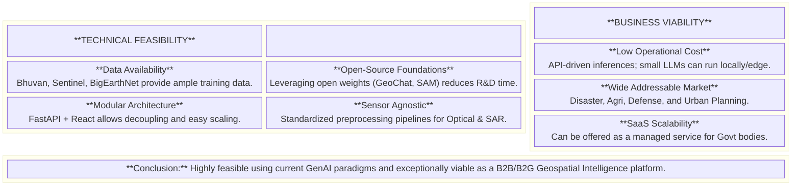
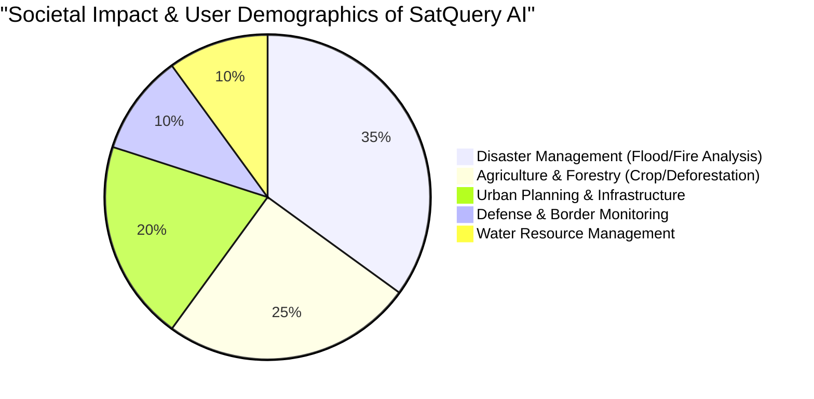

# SIH 2026 Idea Submission Proposal
**Problem Statement ID:** SIH26167
**Problem Statement Title:** SatQuery AI - An Interactive Vision-Language Assistant for Multimodal Remote Sensing Image Analysis through Text Queries
**Theme:** Space Technology

---

## 1. Idea Title
**SatQuery AI: An Agentic Vision-Language Assistant for Multi-Sensor Geospatial Intelligence**

## 2. Proper Idea Description (In Short)
Currently, remote sensing (RS) solutions require deep domain expertise (GIS workflows, sensor calibrations, explicit tool selection) to extract insights, locking non-experts out of critical data. Existing Vision-Language Models (VLMs) focus on simple optical images and struggle with ISRO-specific sensors (Cartosat, RISAT), multi-temporal change detection, and complex reasoning. 

**SatQuery AI** is an intelligent, multi-modal Vision-Language Assistant that allows any user to upload satellite imagery (Optical or SAR) and ask plain-English questions like *"Where are the flooded regions?"* or *"How much has the forest shrunk since last year?"*. 

It works by employing a **ReAct Agentic Router** that doesn't just guess an answer—it intelligently routes the user's query to a suite of deterministic specialist tools (Spectral Index calculators, SAR pre-processors, Object Counters, Change Detectors) and specialized fine-tuned VLMs (like GeoChat). The results are dynamically synthesized into an explainable, grounded response with visual overlays (GeoJSON annotations). SatQuery AI bridges the gap between complex ISRO sensor data and operational decision-makers in disaster management, agriculture, and urban planning.

---

## 3. Workflow of Project (Diagram)

```mermaid
flowchart TD
    %% Styling
    classDef input fill:#e1f5fe,stroke:#0288d1,stroke-width:2px;
    classDef brain fill:#fff3e0,stroke:#f57c00,stroke-width:2px;
    classDef tool fill:#e8f5e9,stroke:#388e3c,stroke-width:2px;
    classDef output fill:#f3e5f5,stroke:#7b1fa2,stroke-width:2px;

    User([User]) -->|1. Uploads Image\n(Optical/SAR)| UI
    User -->|2. Asks Query\n(e.g., 'Find floods')| UI
    
    UI[Web Interface] --> Gateway[FastAPI Gateway]
    
    Gateway --> Router{ReAct Agentic\nRouter}:::brain
    
    %% Tool execution block
    Router -->|Query Classification| Tool1[Specialist Tool: Spectral Indices]:::tool
    Router -->|Query Classification| Tool2[Specialist Tool: Change Detection]:::tool
    Router -->|Query Classification| Tool3[Specialist Tool: SAR Processing]:::tool
    Router -->|Query Classification| Tool4[Specialist Tool: Object Counter]:::tool
    
    %% Multimodal fusion
    Tool1 & Tool2 & Tool3 & Tool4 --> Fusion[Multimodal Context Fusion]
    
    Fusion --> VLM[Fine-Tuned VLM Engine\ne.g., GeoChat]:::brain
    
    %% Output generation
    VLM --> Synthesis[Response Synthesis]
    Synthesis -->|Natural Language| Answer[Textual Explanation]:::output
    Synthesis -->|Bounding Boxes/Masks| Viz[Visual Overlay/GeoJSON]:::output
    
    Answer & Viz --> UI
```

---

## 4. Feasibility & Viability Block Diagram



---

## 5. Impact and Benefit Pie Chart



**Impact Breakdown:**
- **Disaster Management (35%):** Rapid response teams can instantly query SAR imagery to identify flooded regions through cloud cover without waiting for GIS analysts.
- **Agriculture & Forestry (25%):** Farmers and forest rangers can track vegetation health (NDVI) and illegal deforestation via simple text queries over time.
- **Urban Planning (20%):** Municipalities can auto-detect illegal constructions, urban sprawl, and infrastructure development.
- **Defense (10%):** Border security forces can detect anomalies and count ships/vehicles in specific regions.
- **Water Resources (10%):** Tracking shrinking water bodies and reservoir capacities over multiple seasons.

---

## 6. Research and References (Details & Links)

Our architecture and methodology are heavily backed by the latest advancements in Vision-Language Models for Remote Sensing.

1. **GeoChat: Grounded Large Vision-Language Model for Remote Sensing**
   - *Details:* The foundational approach for grounding remote sensing images to text. We utilize its methodologies for aligning visual features with natural language.
   - *Link:* [arXiv:2311.15826](https://arxiv.org/abs/2311.15826)
2. **RSVQA: Visual Question Answering for Remote Sensing Data**
   - *Details:* Provides the baseline taxonomy for Question Answering in satellite imagery (Presence, Counting, Area, Comparison).
   - *Link:* [IEEE TGRS](https://ieeexplore.ieee.org/document/9076068)
3. **BigEarthNet: A Large-Scale Multispectral Image Archive**
   - *Details:* Serves as the primary reference dataset for complex multi-label land-cover classification and fine-tuning our embedding space.
   - *Link:* [BigEarthNet](http://bigearth.net/)
4. **Segment Anything Model (SAM) for Geospatial Analytics**
   - *Details:* We integrate SAM-based foundational models for zero-shot semantic segmentation when a user asks "Show me the boundaries of..."
   - *Link:* [arXiv:2304.02643](https://arxiv.org/abs/2304.02643)
5. **ReAct: Synergizing Reasoning and Acting in Language Models**
   - *Details:* The core paper behind our "Agentic Router" that allows the LLM to write out a reasoning trace before invoking deterministic Python tools.
   - *Link:* [arXiv:2210.03629](https://arxiv.org/abs/2210.03629)
